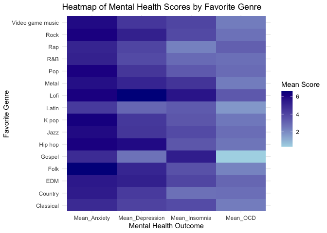

STAT 325 Project
================
Tina Ma
2024-12-05

``` r
data <- read.csv("mxmh_survey_results.csv")
relevant_columns <- c("Age", "Fav.genre", "Hours.per.day", "Instrumentalist", "Composer", 
                      "Music.effects", "Anxiety", "Depression", "Insomnia", "OCD")
cleaned_data <- data %>%
  select(all_of(relevant_columns)) %>%
  drop_na()
cleaned_data <- cleaned_data %>%
  mutate(
    Instrumentalist = ifelse(Instrumentalist == "Yes", 1, 0),
    Composer = ifelse(Composer == "Yes", 1, 0),
    Music.effects = factor(Music.effects, levels = unique(Music.effects))
  )
```

``` r
heatmap_data <- cleaned_data %>%
  group_by(Fav.genre) %>%
  summarize(
    Mean_Anxiety = mean(Anxiety),
    Mean_Depression = mean(Depression),
    Mean_Insomnia = mean(Insomnia),
    Mean_OCD = mean(OCD)
  ) %>%
  pivot_longer(cols = starts_with("Mean"), names_to = "Mental_Health", values_to = "Mean_Score")
#Heatmap
ggplot(heatmap_data, aes(x = Mental_Health, y = Fav.genre, fill = Mean_Score)) +
  geom_tile() +
  scale_fill_gradient(low = "lightblue", high = "darkblue") +
  labs(
    title = "Heatmap of Mental Health Scores by Favorite Genre",
    x = "Mental Health Outcome",
    y = "Favorite Genre",
    fill = "Mean Score"
  ) +
  theme_minimal()
```

<!-- -->

``` r
model_anxiety <- lm(Anxiety ~ Fav.genre + Age + Hours.per.day, data = cleaned_data)
summary(model_anxiety)
```

    ## 
    ## Call:
    ## lm(formula = Anxiety ~ Fav.genre + Age + Hours.per.day, data = cleaned_data)
    ## 
    ## Residuals:
    ##     Min      1Q  Median      3Q     Max 
    ## -6.9655 -2.0502  0.4464  1.9440  5.7767 
    ## 
    ## Coefficients:
    ##                            Estimate Std. Error t value Pr(>|t|)    
    ## (Intercept)                5.917256   0.454374  13.023  < 2e-16 ***
    ## Fav.genreCountry           0.450075   0.664600   0.677  0.49849    
    ## Fav.genreEDM               0.336008   0.590515   0.569  0.56953    
    ## Fav.genreFolk              1.644675   0.625689   2.629  0.00876 ** 
    ## Fav.genreGospel            1.275223   1.207770   1.056  0.29139    
    ## Fav.genreHip hop           1.058020   0.603181   1.754  0.07985 .  
    ## Fav.genreJazz              0.861945   0.723770   1.191  0.23408    
    ## Fav.genreK pop             0.946612   0.660174   1.434  0.15204    
    ## Fav.genreLatin            -1.106885   1.631609  -0.678  0.49774    
    ## Fav.genreLofi              0.969689   0.945703   1.025  0.30554    
    ## Fav.genreMetal             0.792402   0.476771   1.662  0.09695 .  
    ## Fav.genrePop               1.054803   0.455953   2.313  0.02098 *  
    ## Fav.genreR&B               0.218381   0.596731   0.366  0.71450    
    ## Fav.genreRap              -0.105289   0.700343  -0.150  0.88054    
    ## Fav.genreRock              1.298272   0.427070   3.040  0.00245 ** 
    ## Fav.genreVideo game music  0.792530   0.559910   1.415  0.15737    
    ## Age                       -0.044340   0.008847  -5.012 6.79e-07 ***
    ## Hours.per.day              0.045946   0.034203   1.343  0.17960    
    ## ---
    ## Signif. codes:  0 '***' 0.001 '**' 0.01 '*' 0.05 '.' 0.1 ' ' 1
    ## 
    ## Residual standard error: 2.738 on 717 degrees of freedom
    ## Multiple R-squared:  0.06094,    Adjusted R-squared:  0.03868 
    ## F-statistic: 2.737 on 17 and 717 DF,  p-value: 0.0002014

``` r
regression_table <- tidy(model_anxiety)
knitr::kable(regression_table, caption = "Regression Estimates for Anxiety")
```

| term                      |   estimate | std.error |  statistic |   p.value |
|:--------------------------|-----------:|----------:|-----------:|----------:|
| (Intercept)               |  5.9172564 | 0.4543744 | 13.0228639 | 0.0000000 |
| Fav.genreCountry          |  0.4500753 | 0.6645997 |  0.6772126 | 0.4984895 |
| Fav.genreEDM              |  0.3360083 | 0.5905146 |  0.5690093 | 0.5695280 |
| Fav.genreFolk             |  1.6446750 | 0.6256885 |  2.6285842 | 0.0087577 |
| Fav.genreGospel           |  1.2752233 | 1.2077704 |  1.0558491 | 0.2913928 |
| Fav.genreHip hop          |  1.0580201 | 0.6031814 |  1.7540661 | 0.0798464 |
| Fav.genreJazz             |  0.8619450 | 0.7237705 |  1.1909094 | 0.2340833 |
| Fav.genreK pop            |  0.9466121 | 0.6601745 |  1.4338817 | 0.1520420 |
| Fav.genreLatin            | -1.1068847 | 1.6316088 | -0.6784008 | 0.4977365 |
| Fav.genreLofi             |  0.9696890 | 0.9457035 |  1.0253626 | 0.3055379 |
| Fav.genreMetal            |  0.7924016 | 0.4767707 |  1.6620183 | 0.0969462 |
| Fav.genrePop              |  1.0548025 | 0.4559532 |  2.3134009 | 0.0209826 |
| Fav.genreR&B              |  0.2183809 | 0.5967306 |  0.3659622 | 0.7145012 |
| Fav.genreRap              | -0.1052888 | 0.7003426 | -0.1503390 | 0.8805395 |
| Fav.genreRock             |  1.2982717 | 0.4270702 |  3.0399489 | 0.0024523 |
| Fav.genreVideo game music |  0.7925300 | 0.5599101 |  1.4154594 | 0.1573680 |
| Age                       | -0.0443401 | 0.0088467 | -5.0120531 | 0.0000007 |
| Hours.per.day             |  0.0459456 | 0.0342034 |  1.3433037 | 0.1795987 |

Regression Estimates for Anxiety

``` r
# Reduced model
reduced_model <- lm(Anxiety ~ Fav.genre + Age, data = cleaned_data)
summary(reduced_model)
```

    ## 
    ## Call:
    ## lm(formula = Anxiety ~ Fav.genre + Age, data = cleaned_data)
    ## 
    ## Residuals:
    ##     Min      1Q  Median      3Q     Max 
    ## -6.6778 -2.0901  0.5002  1.9483  5.7182 
    ## 
    ## Coefficients:
    ##                            Estimate Std. Error t value Pr(>|t|)    
    ## (Intercept)                6.059643   0.442085  13.707  < 2e-16 ***
    ## Fav.genreCountry           0.474461   0.664724   0.714  0.47560    
    ## Fav.genreEDM               0.413105   0.588048   0.703  0.48259    
    ## Fav.genreFolk              1.660805   0.625924   2.653  0.00815 ** 
    ## Fav.genreGospel            1.263115   1.208413   1.045  0.29625    
    ## Fav.genreHip hop           1.106298   0.602447   1.836  0.06672 .  
    ## Fav.genreJazz              0.978486   0.718954   1.361  0.17395    
    ## Fav.genreK pop             0.995010   0.659560   1.509  0.13184    
    ## Fav.genreLatin            -0.936253   1.627568  -0.575  0.56530    
    ## Fav.genreLofi              1.028673   0.945213   1.088  0.27683    
    ## Fav.genreMetal             0.824807   0.476427   1.731  0.08384 .  
    ## Fav.genrePop               1.054859   0.456209   2.312  0.02105 *  
    ## Fav.genreR&B               0.245123   0.596732   0.411  0.68136    
    ## Fav.genreRap               0.004947   0.695908   0.007  0.99433    
    ## Fav.genreRock              1.333655   0.426496   3.127  0.00184 ** 
    ## Fav.genreVideo game music  0.792270   0.560224   1.414  0.15774    
    ## Age                       -0.044720   0.008847  -5.055 5.47e-07 ***
    ## ---
    ## Signif. codes:  0 '***' 0.001 '**' 0.01 '*' 0.05 '.' 0.1 ' ' 1
    ## 
    ## Residual standard error: 2.74 on 718 degrees of freedom
    ## Multiple R-squared:  0.05858,    Adjusted R-squared:  0.0376 
    ## F-statistic: 2.792 on 16 and 718 DF,  p-value: 0.0002144

``` r
AIC(model_anxiety, reduced_model)
```

    ##               df      AIC
    ## model_anxiety 19 3586.228
    ## reduced_model 18 3586.076

``` r
model_anxiety <- lm(Anxiety ~ Age + Hours.per.day + Instrumentalist + Composer + 
                    Music.effects, data = cleaned_data)
summary(model_anxiety)
```

    ## 
    ## Call:
    ## lm(formula = Anxiety ~ Age + Hours.per.day + Instrumentalist + 
    ##     Composer + Music.effects, data = cleaned_data)
    ## 
    ## Residuals:
    ##     Min      1Q  Median      3Q     Max 
    ## -6.4016 -2.0971  0.5594  1.9045  5.6772 
    ## 
    ## Coefficients:
    ##                         Estimate Std. Error t value Pr(>|t|)    
    ## (Intercept)             5.853739   1.010053   5.795 1.02e-08 ***
    ## Age                    -0.037742   0.008478  -4.452 9.85e-06 ***
    ## Hours.per.day           0.038345   0.033837   1.133    0.257    
    ## Instrumentalist         0.034847   0.239260   0.146    0.884    
    ## Composer               -0.149714   0.295925  -0.506    0.613    
    ## Music.effectsNo effect  0.155947   0.991068   0.157    0.875    
    ## Music.effectsImprove    0.997172   0.976363   1.021    0.307    
    ## Music.effectsWorsen     1.669104   1.174455   1.421    0.156    
    ## ---
    ## Signif. codes:  0 '***' 0.001 '**' 0.01 '*' 0.05 '.' 0.1 ' ' 1
    ## 
    ## Residual standard error: 2.732 on 727 degrees of freedom
    ## Multiple R-squared:  0.05192,    Adjusted R-squared:  0.04279 
    ## F-statistic: 5.687 on 7 and 727 DF,  p-value: 2.051e-06

``` r
regression_table <- tidy(model_anxiety)
knitr::kable(regression_table, caption = "Regression Estimates for Anxiety")
```

| term                   |   estimate | std.error |  statistic |   p.value |
|:-----------------------|-----------:|----------:|-----------:|----------:|
| (Intercept)            |  5.8537394 | 1.0100529 |  5.7954780 | 0.0000000 |
| Age                    | -0.0377416 | 0.0084776 | -4.4519390 | 0.0000098 |
| Hours.per.day          |  0.0383449 | 0.0338367 |  1.1332348 | 0.2574892 |
| Instrumentalist        |  0.0348471 | 0.2392600 |  0.1456455 | 0.8842417 |
| Composer               | -0.1497141 | 0.2959253 | -0.5059185 | 0.6130672 |
| Music.effectsNo effect |  0.1559473 | 0.9910675 |  0.1573529 | 0.8750105 |
| Music.effectsImprove   |  0.9971724 | 0.9763629 |  1.0213133 | 0.3074458 |
| Music.effectsWorsen    |  1.6691043 | 1.1744546 |  1.4211739 | 0.1556950 |

Regression Estimates for Anxiety

``` r
model_depression <- lm(Depression ~ Age + Hours.per.day + Instrumentalist + Composer + 
                       Music.effects, data = cleaned_data)
summary(model_depression)
```

    ## 
    ## Call:
    ## lm(formula = Depression ~ Age + Hours.per.day + Instrumentalist + 
    ##     Composer + Music.effects, data = cleaned_data)
    ## 
    ## Residuals:
    ##     Min      1Q  Median      3Q     Max 
    ## -7.7740 -2.5769  0.3044  2.4039  6.6161 
    ## 
    ## Coefficients:
    ##                         Estimate Std. Error t value Pr(>|t|)    
    ## (Intercept)             4.811869   1.099889   4.375 1.39e-05 ***
    ## Age                    -0.027750   0.009232  -3.006  0.00274 ** 
    ## Hours.per.day           0.102310   0.036846   2.777  0.00563 ** 
    ## Instrumentalist        -0.157183   0.260540  -0.603  0.54650    
    ## Composer                0.324020   0.322245   1.006  0.31499    
    ## Music.effectsNo effect -0.043074   1.079215  -0.040  0.96817    
    ## Music.effectsImprove    0.356783   1.063203   0.336  0.73729    
    ## Music.effectsWorsen     2.709071   1.278913   2.118  0.03449 *  
    ## ---
    ## Signif. codes:  0 '***' 0.001 '**' 0.01 '*' 0.05 '.' 0.1 ' ' 1
    ## 
    ## Residual standard error: 2.975 on 727 degrees of freedom
    ## Multiple R-squared:  0.04522,    Adjusted R-squared:  0.03603 
    ## F-statistic: 4.919 on 7 and 727 DF,  p-value: 1.912e-05

``` r
regression_table_depression <- tidy(model_depression)
knitr::kable(regression_table_depression, caption = "Regression Estimates for Depression")
```

| term                   |   estimate | std.error |  statistic |   p.value |
|:-----------------------|-----------:|----------:|-----------:|----------:|
| (Intercept)            |  4.8118692 | 1.0998890 |  4.3748682 | 0.0000139 |
| Age                    | -0.0277503 | 0.0092316 | -3.0060236 | 0.0027380 |
| Hours.per.day          |  0.1023105 | 0.0368462 |  2.7766894 | 0.0056329 |
| Instrumentalist        | -0.1571827 | 0.2605403 | -0.6032953 | 0.5465004 |
| Composer               |  0.3240197 | 0.3222455 |  1.0055057 | 0.3149879 |
| Music.effectsNo effect | -0.0430738 | 1.0792150 | -0.0399121 | 0.9681741 |
| Music.effectsImprove   |  0.3567831 | 1.0632025 |  0.3355740 | 0.7372890 |
| Music.effectsWorsen    |  2.7090706 | 1.2789129 |  2.1182604 | 0.0344917 |

Regression Estimates for Depression

``` r
model_insomnia <- lm(Insomnia ~ Age + Hours.per.day + Instrumentalist + Composer + 
                     Music.effects, data = cleaned_data)
summary(model_insomnia)
```

    ## 
    ## Call:
    ## lm(formula = Insomnia ~ Age + Hours.per.day + Instrumentalist + 
    ##     Composer + Music.effects, data = cleaned_data)
    ## 
    ## Residuals:
    ##     Min      1Q  Median      3Q     Max 
    ## -7.3066 -2.6467 -0.4005  2.5773  6.8321 
    ## 
    ## Coefficients:
    ##                        Estimate Std. Error t value Pr(>|t|)    
    ## (Intercept)            1.888192   1.130696   1.670  0.09536 .  
    ## Age                    0.004931   0.009490   0.520  0.60354    
    ## Hours.per.day          0.134480   0.037878   3.550  0.00041 ***
    ## Instrumentalist        0.007411   0.267838   0.028  0.97793    
    ## Composer               0.632252   0.331271   1.909  0.05671 .  
    ## Music.effectsNo effect 1.112401   1.109443   1.003  0.31636    
    ## Music.effectsImprove   1.131836   1.092982   1.036  0.30076    
    ## Music.effectsWorsen    2.081633   1.314734   1.583  0.11379    
    ## ---
    ## Signif. codes:  0 '***' 0.001 '**' 0.01 '*' 0.05 '.' 0.1 ' ' 1
    ## 
    ## Residual standard error: 3.058 on 727 degrees of freedom
    ## Multiple R-squared:  0.02974,    Adjusted R-squared:  0.0204 
    ## F-statistic: 3.183 on 7 and 727 DF,  p-value: 0.002517

``` r
regression_table_insomnia <- tidy(model_insomnia)
knitr::kable(regression_table_insomnia, caption = "Regression Estimates for Insomnia")
```

| term                   |  estimate | std.error | statistic |   p.value |
|:-----------------------|----------:|----------:|----------:|----------:|
| (Intercept)            | 1.8881924 | 1.1306956 | 1.6699388 | 0.0953619 |
| Age                    | 0.0049306 | 0.0094901 | 0.5195464 | 0.6035379 |
| Hours.per.day          | 0.1344797 | 0.0378782 | 3.5503172 | 0.0004095 |
| Instrumentalist        | 0.0074105 | 0.2678377 | 0.0276681 | 0.9779345 |
| Composer               | 0.6322518 | 0.3312712 | 1.9085626 | 0.0567121 |
| Music.effectsNo effect | 1.1124005 | 1.1094426 | 1.0026661 | 0.3163556 |
| Music.effectsImprove   | 1.1318364 | 1.0929816 | 1.0355493 | 0.3007568 |
| Music.effectsWorsen    | 2.0816333 | 1.3147338 | 1.5833116 | 0.1137854 |

Regression Estimates for Insomnia

``` r
model_ocd <- lm(OCD ~ Age + Hours.per.day + Instrumentalist + Composer + 
                Music.effects, data = cleaned_data)
summary(model_ocd)
```

    ## 
    ## Call:
    ## lm(formula = OCD ~ Age + Hours.per.day + Instrumentalist + Composer + 
    ##     Music.effects, data = cleaned_data)
    ## 
    ## Residuals:
    ##     Min      1Q  Median      3Q     Max 
    ## -4.1486 -2.3307 -0.7568  1.8351  8.1894 
    ## 
    ## Coefficients:
    ##                         Estimate Std. Error t value Pr(>|t|)   
    ## (Intercept)             2.553533   1.037487   2.461  0.01408 * 
    ## Age                    -0.028357   0.008708  -3.256  0.00118 **
    ## Hours.per.day           0.107324   0.034756   3.088  0.00209 **
    ## Instrumentalist         0.025985   0.245759   0.106  0.91582   
    ## Composer               -0.083616   0.303963  -0.275  0.78333   
    ## Music.effectsNo effect  0.198921   1.017986   0.195  0.84513   
    ## Music.effectsImprove    0.473034   1.002882   0.472  0.63730   
    ## Music.effectsWorsen     0.913314   1.206354   0.757  0.44924   
    ## ---
    ## Signif. codes:  0 '***' 0.001 '**' 0.01 '*' 0.05 '.' 0.1 ' ' 1
    ## 
    ## Residual standard error: 2.806 on 727 degrees of freedom
    ## Multiple R-squared:  0.03246,    Adjusted R-squared:  0.02315 
    ## F-statistic: 3.485 on 7 and 727 DF,  p-value: 0.001105

``` r
regression_table_ocd <- tidy(model_ocd)
knitr::kable(regression_table_ocd, caption = "Regression Estimates for OCD")
```

| term                   |   estimate | std.error |  statistic |   p.value |
|:-----------------------|-----------:|----------:|-----------:|----------:|
| (Intercept)            |  2.5535330 | 1.0374871 |  2.4612672 | 0.0140760 |
| Age                    | -0.0283567 | 0.0087078 | -3.2564619 | 0.0011804 |
| Hours.per.day          |  0.1073239 | 0.0347558 |  3.0879460 | 0.0020921 |
| Instrumentalist        |  0.0259853 | 0.2457586 |  0.1057349 | 0.9158218 |
| Composer               | -0.0836162 | 0.3039630 | -0.2750869 | 0.7833277 |
| Music.effectsNo effect |  0.1989215 | 1.0179861 |  0.1954069 | 0.8451290 |
| Music.effectsImprove   |  0.4730339 | 1.0028821 |  0.4716745 | 0.6373007 |
| Music.effectsWorsen    |  0.9133140 | 1.2063542 |  0.7570861 | 0.4492436 |

Regression Estimates for OCD

``` r
regression_table_combined <- bind_rows(
  tidy(model_anxiety) %>% mutate(Model = "Anxiety"),
  tidy(model_depression) %>% mutate(Model = "Depression"),
  tidy(model_insomnia) %>% mutate(Model = "Insomnia"),
  tidy(model_ocd) %>% mutate(Model = "OCD")
)
regression_table_combined <- regression_table_combined %>%
  select(Model, term, estimate, std.error, statistic, p.value)
knitr::kable(
  regression_table_combined,
  caption = "Combined Regression Estimates for All Mental Health Models",
  digits = 3
)
```

| Model      | term                   | estimate | std.error | statistic | p.value |
|:-----------|:-----------------------|---------:|----------:|----------:|--------:|
| Anxiety    | (Intercept)            |    5.854 |     1.010 |     5.795 |   0.000 |
| Anxiety    | Age                    |   -0.038 |     0.008 |    -4.452 |   0.000 |
| Anxiety    | Hours.per.day          |    0.038 |     0.034 |     1.133 |   0.257 |
| Anxiety    | Instrumentalist        |    0.035 |     0.239 |     0.146 |   0.884 |
| Anxiety    | Composer               |   -0.150 |     0.296 |    -0.506 |   0.613 |
| Anxiety    | Music.effectsNo effect |    0.156 |     0.991 |     0.157 |   0.875 |
| Anxiety    | Music.effectsImprove   |    0.997 |     0.976 |     1.021 |   0.307 |
| Anxiety    | Music.effectsWorsen    |    1.669 |     1.174 |     1.421 |   0.156 |
| Depression | (Intercept)            |    4.812 |     1.100 |     4.375 |   0.000 |
| Depression | Age                    |   -0.028 |     0.009 |    -3.006 |   0.003 |
| Depression | Hours.per.day          |    0.102 |     0.037 |     2.777 |   0.006 |
| Depression | Instrumentalist        |   -0.157 |     0.261 |    -0.603 |   0.547 |
| Depression | Composer               |    0.324 |     0.322 |     1.006 |   0.315 |
| Depression | Music.effectsNo effect |   -0.043 |     1.079 |    -0.040 |   0.968 |
| Depression | Music.effectsImprove   |    0.357 |     1.063 |     0.336 |   0.737 |
| Depression | Music.effectsWorsen    |    2.709 |     1.279 |     2.118 |   0.034 |
| Insomnia   | (Intercept)            |    1.888 |     1.131 |     1.670 |   0.095 |
| Insomnia   | Age                    |    0.005 |     0.009 |     0.520 |   0.604 |
| Insomnia   | Hours.per.day          |    0.134 |     0.038 |     3.550 |   0.000 |
| Insomnia   | Instrumentalist        |    0.007 |     0.268 |     0.028 |   0.978 |
| Insomnia   | Composer               |    0.632 |     0.331 |     1.909 |   0.057 |
| Insomnia   | Music.effectsNo effect |    1.112 |     1.109 |     1.003 |   0.316 |
| Insomnia   | Music.effectsImprove   |    1.132 |     1.093 |     1.036 |   0.301 |
| Insomnia   | Music.effectsWorsen    |    2.082 |     1.315 |     1.583 |   0.114 |
| OCD        | (Intercept)            |    2.554 |     1.037 |     2.461 |   0.014 |
| OCD        | Age                    |   -0.028 |     0.009 |    -3.256 |   0.001 |
| OCD        | Hours.per.day          |    0.107 |     0.035 |     3.088 |   0.002 |
| OCD        | Instrumentalist        |    0.026 |     0.246 |     0.106 |   0.916 |
| OCD        | Composer               |   -0.084 |     0.304 |    -0.275 |   0.783 |
| OCD        | Music.effectsNo effect |    0.199 |     1.018 |     0.195 |   0.845 |
| OCD        | Music.effectsImprove   |    0.473 |     1.003 |     0.472 |   0.637 |
| OCD        | Music.effectsWorsen    |    0.913 |     1.206 |     0.757 |   0.449 |

Combined Regression Estimates for All Mental Health Models

``` r
reduced_model_anxiety <- lm(Anxiety ~ Age, data = cleaned_data)
AIC(model_anxiety, reduced_model_anxiety)
```

    ##                       df     AIC
    ## model_anxiety          9 3573.26
    ## reduced_model_anxiety  3 3577.14

``` r
reduced_model_depression <- lm(Depression ~ Age + Hours.per.day, data = cleaned_data)
AIC(model_depression, reduced_model_depression)
```

    ##                          df      AIC
    ## model_depression          9 3698.513
    ## reduced_model_depression  4 3703.299

``` r
reduced_model_insomnia <- lm(Insomnia ~ Hours.per.day, data = cleaned_data)
AIC(model_insomnia, reduced_model_insomnia)
```

    ##                        df     AIC
    ## model_insomnia          9 3739.12
    ## reduced_model_insomnia  3 3734.40

``` r
reduced_model_ocd <- lm(OCD ~ Age + Hours.per.day, data = cleaned_data)
AIC(model_ocd, reduced_model_ocd)
```

    ##                   df      AIC
    ## model_ocd          9 3612.654
    ## reduced_model_ocd  4 3604.645

``` r
shapiro.test(residuals(model_anxiety))
```

    ## 
    ##  Shapiro-Wilk normality test
    ## 
    ## data:  residuals(model_anxiety)
    ## W = 0.97455, p-value = 5.24e-10

``` r
shapiro.test(residuals(model_depression))
```

    ## 
    ##  Shapiro-Wilk normality test
    ## 
    ## data:  residuals(model_depression)
    ## W = 0.9709, p-value = 6.399e-11

``` r
shapiro.test(residuals(reduced_model_insomnia))
```

    ## 
    ##  Shapiro-Wilk normality test
    ## 
    ## data:  residuals(reduced_model_insomnia)
    ## W = 0.94697, p-value = 1.432e-15

``` r
shapiro.test(residuals(reduced_model_ocd))
```

    ## 
    ##  Shapiro-Wilk normality test
    ## 
    ## data:  residuals(reduced_model_ocd)
    ## W = 0.90031, p-value < 2.2e-16

``` r
model_log1 <- lm(log(Anxiety+1) ~ Age, data = cleaned_data)
model_log2 <- lm(log(Depression+1) ~ Age + Hours.per.day, data = cleaned_data)
model_log3 <- lm(log(Insomnia+1) ~ Hours.per.day, data = cleaned_data)
model_log4 <- lm(log(OCD+1) ~ Age + Hours.per.day, data = cleaned_data)
```

``` r
shapiro.test(residuals(model_log1))
```

    ## 
    ##  Shapiro-Wilk normality test
    ## 
    ## data:  residuals(model_log1)
    ## W = 0.85558, p-value < 2.2e-16

``` r
shapiro.test(residuals(model_log2))
```

    ## 
    ##  Shapiro-Wilk normality test
    ## 
    ## data:  residuals(model_log2)
    ## W = 0.88179, p-value < 2.2e-16

``` r
shapiro.test(residuals(model_log3))
```

    ## 
    ##  Shapiro-Wilk normality test
    ## 
    ## data:  residuals(model_log3)
    ## W = 0.91732, p-value < 2.2e-16

``` r
shapiro.test(residuals(model_log4))
```

    ## 
    ##  Shapiro-Wilk normality test
    ## 
    ## data:  residuals(model_log4)
    ## W = 0.92519, p-value < 2.2e-16

``` r
library(lmtest)
```

    ## Loading required package: zoo

    ## 
    ## Attaching package: 'zoo'

    ## The following objects are masked from 'package:base':
    ## 
    ##     as.Date, as.Date.numeric

``` r
bptest(model_anxiety)
```

    ## 
    ##  studentized Breusch-Pagan test
    ## 
    ## data:  model_anxiety
    ## BP = 13.987, df = 7, p-value = 0.05141

``` r
bptest(model_depression)
```

    ## 
    ##  studentized Breusch-Pagan test
    ## 
    ## data:  model_depression
    ## BP = 17.227, df = 7, p-value = 0.01599

``` r
bptest(reduced_model_insomnia)
```

    ## 
    ##  studentized Breusch-Pagan test
    ## 
    ## data:  reduced_model_insomnia
    ## BP = 9.2759, df = 1, p-value = 0.002322

``` r
bptest(reduced_model_ocd)
```

    ## 
    ##  studentized Breusch-Pagan test
    ## 
    ## data:  reduced_model_ocd
    ## BP = 10.547, df = 2, p-value = 0.005125
